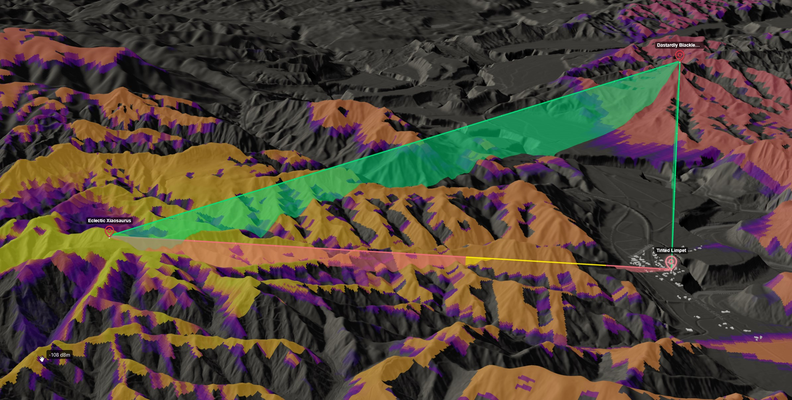
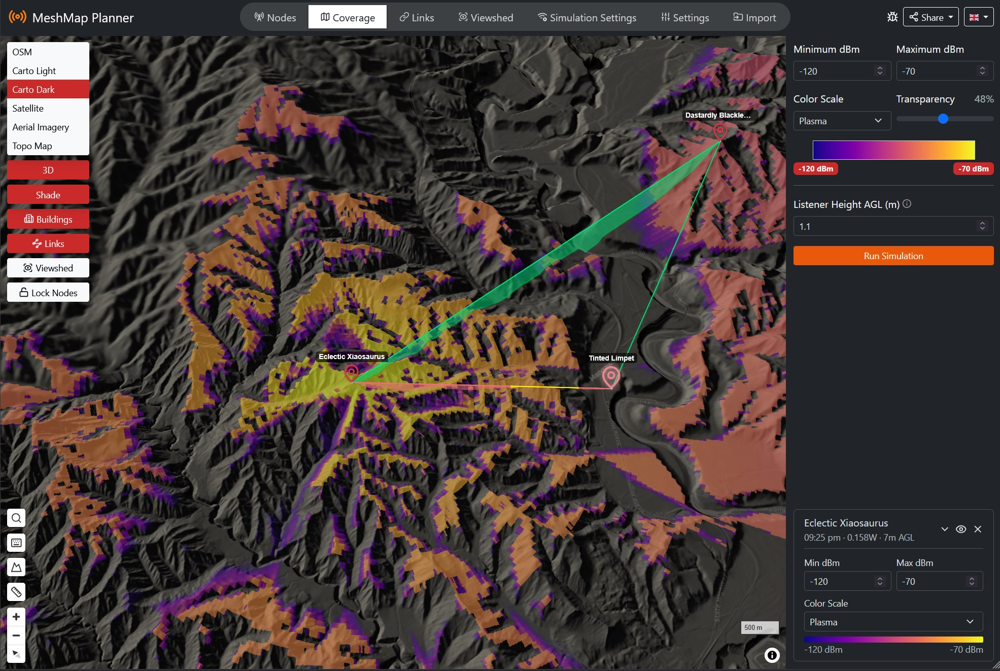
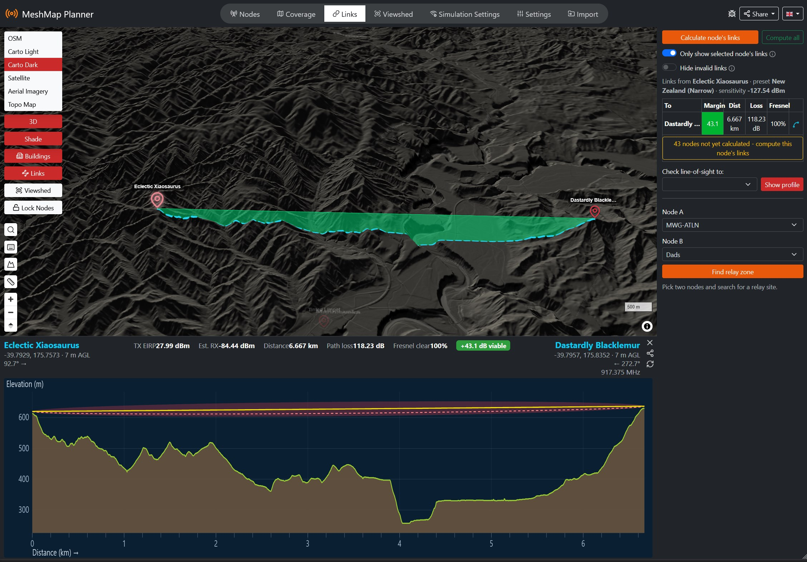
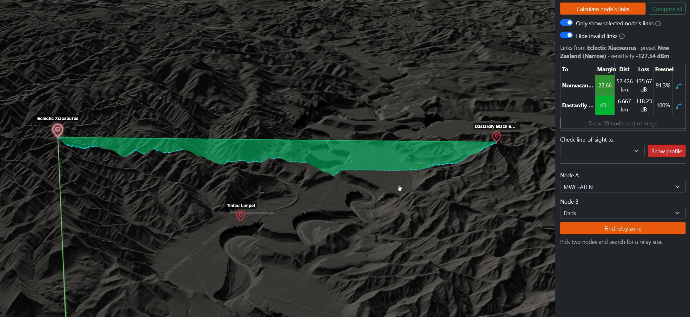
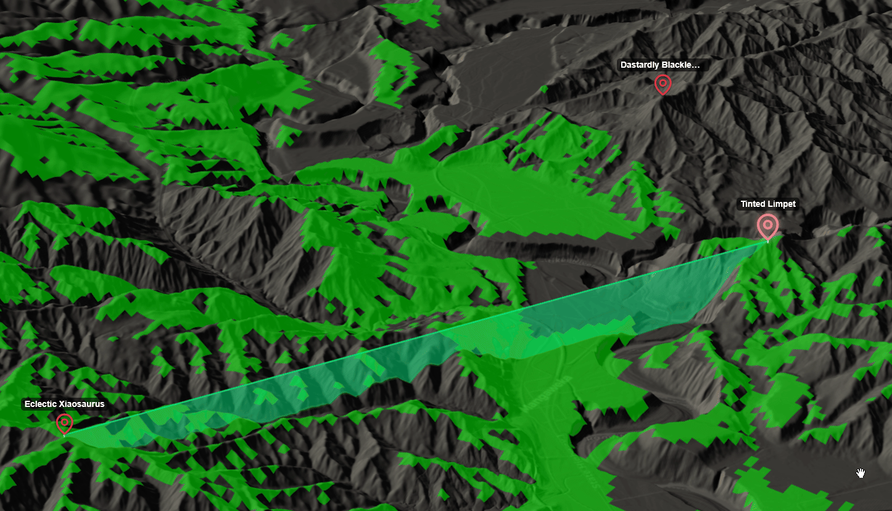
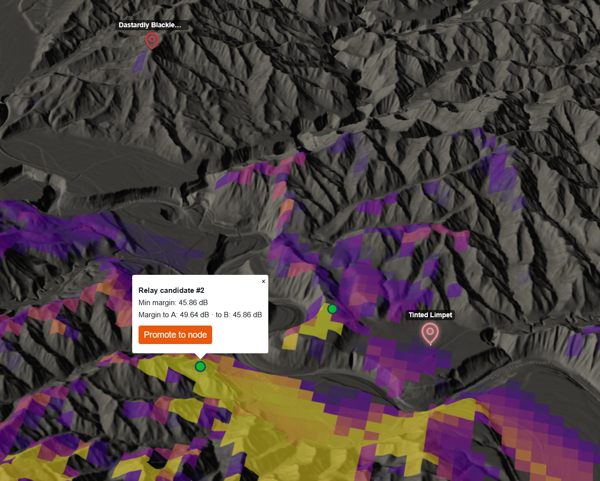

# MeshMap Planner

**▶ Live site: https://moderatewinguy.github.io/MeshMap-Planner/**

Plan mesh radio deployments in your browser — RF coverage, link budgets, line-of-sight and terrain, with nothing to install, no account, and no server.



## About

MeshMap Planner is an online utility for predicting the range of mesh radios. It is agnostic between **Meshcore** and **Meshtastic** and works with any LoRa-based mesh network. It creates radio coverage maps using the ITM/Longley-Rice model — the classic propagation core from SPLAT! by John A. Magliacane, KD2BD (https://www.qsl.net/kd2bd/splat.html), compiled to WebAssembly and run **entirely in your browser**. The maps are used for planning repeater deployments and for estimating the coverage provided by an existing mesh network. The default parameters are derived from experimental data and practical experience with Meshtastic devices, and serve as sensible starting points for Meshcore and amateur radio projects too. Model parameters are adjustable, so this tool can also be used for amateur radio projects using different frequencies and higher transmit powers.

MeshMap Planner is a **static, browser-only single-page app** — there is no backend or server-side computation. The coverage map, link matrix, point-to-point profiles, relay siting, and viewshed all run client-side in a Web Worker. Your nodes, folders and settings are saved in your browser's local storage; there is no account and nothing is uploaded.

A hosted instance is published from `main` to GitHub Pages at **https://moderatewinguy.github.io/MeshMap-Planner/**. To run or modify your own copy, see [Building](#building) below.

Terrain elevation streams from [Mapterhorn](https://mapterhorn.com/) — a global dataset built on the Copernicus GLO-30 DEM with higher-resolution national LiDAR baked in over many regions — and can be layered with higher-detail or custom elevation sources. See [Terrain and elevation](#terrain-and-elevation).

## Features

**Propagation and analysis**

- **Coverage** — ITM/Longley-Rice heatmap draped on the map, for one node or many stacked results. Results are stored per-cell, so you can change receiver sensitivity, colour scale or transparency and re-render instantly without recomputing.
- **Link matrix** — compute one node's links to every other node, or every node-to-node pair, into a table of margin, distance, path loss and Fresnel clearance. Radio-horizon filtering and a max-link-distance cap keep large maps fast.
- **Link profile** — terrain cross-section between two nodes with the first Fresnel zone, TX EIRP, estimated RX, path loss and clearance. Click anywhere along the profile to zoom the map to that point on the path.
- **Viewshed** — GPU line-of-sight for the selected node, tinting everything it can see. Runs on WebGPU where available, with a WebGL2 fallback, and can recompute live as you drag the node.
- **Relay finder** — computes coverage for two nodes, shows where they overlap, and suggests candidate relay sites you can promote straight into real nodes.
- **3D links** — links drawn as lines flying between antenna tops, with terrain-clipping sections highlighted in yellow and an optional drop-curtain down to the ground.

**Terrain and map**

- Six basemaps: OpenStreetMap, Carto Light, Carto Dark, Esri satellite, OpenTopoMap, and LINZ aerial imagery for New Zealand.
- 3D terrain with adjustable vertical exaggeration, and multidirectional relief shading that works in both flat and tilted views.
- **3D buildings** from OpenStreetMap — not just visual: building heights are baked into the shared elevation surface, so coverage, viewshed, link profiles and relay siting all treat them as obstructions.
- Layered elevation providers on top of the Mapterhorn baseline, including your own custom tile sources.

**Nodes**

- Organise nodes into colour-coded folders you can rename, show/hide, reorder and share as a unit.
- Per-node visibility, show/hide all, node locking, and drag-only-the-selected-node to prevent accidental moves.
- Undo for node moves and deletions, paste a full `lat, lon` pair straight into the latitude field, double-click a name to centre the map on it.
- 8 Meshtastic modem presets and 23 MeshCore regional presets, the latter carrying a region frequency you can apply to every node at once.

**Tools**

- **Measure** — click a series of points for a running distance readout.
- **Snap to peak** — while active, placing or dragging a node snaps it to the highest ground within an adjustable 10–500 m radius.
- **Location search** — jump to any place or address.
- Right-click context menu and keyboard shortcuts for the common actions. See [Tools and shortcuts](#tools-and-shortcuts).

**Import and sharing**

- Import MeshCore contacts from a device export file, or pull live repeaters and room servers for your current map view from the public mesh maps.
- Share your whole site, a single node, a folder, or a link profile as a URL — no backend, the data rides in the link.

**Everything else**

- Available in English, German, Spanish, French, Norwegian Bokmål, Polish and Swedish.
- Responsive layout that works on phones and tablets as well as desktop.
- Privacy-friendly, cookieless analytics (GoatCounter) — no tracking cookies, no personal data.

## Quick start

### Coverage

The minimal steps for creating a mesh coverage prediction are:

1. Open the [hosted site](https://moderatewinguy.github.io/MeshMap-Planner/) in a web browser (or run your own copy — see [Building](#building)).
2. Go to the **Simulation Settings** tab and select the radio preset for your region.
3. Add a node by right-clicking the map > **Add node here**, or by pressing <kbd>A</kbd> which will create it at your mouse pointer's location.
4. Drag the node to exactly where you want it if you need to adjust the position.
5. Configure the node's settings in the node settings panel (in the **Nodes** tab).
6. Go to the **Coverage** tab and click **Run Simulation**, or press <kbd>C</kbd>.

Coverage results stack in a list, so you can run several sites and toggle each one's visibility. Because results are stored per-cell, changing the receiver sensitivity or the colour scale re-renders immediately without another simulation run.



### Link profile

To generate a point-to-point profile:

1. Add two nodes to the map.
2. Select one, <kbd>Shift</kbd>+click the other, then click **Calculate link & show profile**.
3. The profile shows the terrain cross-section, the first Fresnel zone, TX EIRP, estimated RX and path loss. Click anywhere along it to zoom the map to that point on the path.
4. After changing a node's height or power, hit **Recalculate** rather than starting over.

By default the signal is drawn as a curve and the terrain flat. The **Show signal as straight line** setting in **Settings** flips this — the same physical geometry, but the terrain curves with the earth instead.



### Link matrix

To see how a node connects to the rest of the mesh, select it and press <kbd>L</kbd> (or **Calculate node's links** in the **Links** tab). For a whole-mesh view, **Compute all** evaluates every node pair — slower on large maps, so two guards are available in **Simulation Settings**:

- **Filter line-of-sight horizon** skips pairs beyond the radio horizon set by the curve of the earth and each node's height above sea level.
- **Max link distance** hard-caps pair distance for **Compute all**, useful when hilltop nodes have very long horizons.

Results land in a table of margin, distance, path loss and Fresnel clearance, with filters to hide invalid links or show only the selected node's. Enable **Links** and **3D** on the map to see them drawn between antenna tops, with terrain-clipping sections in yellow.



### Viewshed

The viewshed is a fast line-of-sight check: select a node, open the **Viewshed** tab, and everything the node can see is tinted green. Adjust the radius, the assumed receiver height at the tested cells, and the tint opacity. **Live recompute while dragging** updates continuously as you move the node — useful for hunting a site, but it wants a reasonably fast GPU.

It needs a browser with WebGPU or WebGL2 support; the rest of the app is unaffected if that's missing.



### Relay finder

The relay finder calculates coverage for two nodes and shows where they overlap, for when you want to find a way to link two nodes that can't reach each other directly.

Select one node, <kbd>Shift</kbd>+click another, then choose **Find relay zone** (also on the right-click menu). You get a heatmap of the overlap, plus a list of candidate points with good margins to both — each one promotable into a real node with a single click.



For a detailed explanation of every adjustable parameter, see [parameters.md](parameters.md).

## Tools and shortcuts

### Keyboard

| Key                                           | Action                                   |
| --------------------------------------------- | ---------------------------------------- |
| <kbd>A</kbd>                                  | Add a node at the cursor                 |
| <kbd>C</kbd>                                  | Calculate coverage for the selected node |
| <kbd>L</kbd>                                  | Calculate links for the selected node    |
| <kbd>H</kbd>                                  | Hide / show the selected node            |
| <kbd>Delete</kbd>                             | Delete the selected node                 |
| <kbd>Ctrl</kbd>/<kbd>Cmd</kbd> + <kbd>Z</kbd> | Undo the last node move or delete        |

<kbd>Shift</kbd>+click a second node to open the link actions between it and the current selection.

### Right-click menu

Right-click anywhere on the map for **Add node here** and **Copy coordinates**. Right-click a node for **Share node**, **Show link profile**, **Find relay zone**, **Show coverage** and **Delete node**.

### Measure

Toggle the ruler from the map tool row, then click points on the map for a running total; double-click to finish. Handy for sanity-checking a path length before committing to a link calculation.

### Snap to peak

Toggle **Snap to highest point** from the map tool row. While it is open, placing or dragging a node snaps it to the highest ground within the search radius — adjustable from 10 to 500 m. Useful for putting a node on the actual summit rather than wherever you happened to click.

### Location search

Search any place or address to fly the map there. Geocoding is by [Nominatim](https://nominatim.openstreetmap.org/).

## Importing nodes

The **Import** tab brings existing MeshCore nodes onto the map two ways.

**From a contacts export.** Pick a MeshCore contacts export (JSON) from your device. Repeaters and room servers that carry a location are listed for you to select, and land in an **Imported** folder. Contacts without a location are skipped and counted. [ExampleExport.json](ExampleExport.json) in this repo shows the expected shape.

**From the public maps.** **Sync public map** pulls repeaters and room servers in your _current map view_ from the public mesh maps into a **Public MeshCore** folder:

- [MeshCore](https://meshcore.io/) — one global endpoint, carrying each node's real LoRa frequency.
- [MeshMapper](https://meshmapper.net/) — regional endpoints resolved from your view.

Results are deduplicated across both sources by public key, and against nodes already on your map, so re-syncing never creates duplicates. Zoom in to narrow the area before syncing a dense region.

## Sharing

Every share is a plain URL with the data encoded in it — there is no server storing anything. Recipients get a banner asking whether to add the shared nodes to their own map.

- **Whole site** — every node on your map.
- **Selected node** — one node, also on its right-click menu.
- **Folder** — a folder and its nodes, from the folder header.
- **Link profile** — the two endpoints of a profile, from the profile strip.

## Terrain and elevation

The baseline elevation source is [Mapterhorn](https://mapterhorn.com/): global, free, no key, built on the Copernicus GLO-30 DEM with higher-resolution national LiDAR baked in over many regions (about 4 m for New Zealand's LINZ data, for example). See Mapterhorn's [source attribution list](https://mapterhorn.com/attribution) for the per-country breakdown.

On top of that baseline, **terrain providers** (in **Settings**) layer higher-detail elevation wherever they have data — the baseline still fills in the rest of the world, so enabling one never leaves a hole. All compositing happens in your browser; there is no backend. Three are built in:

- **OSM Buildings** — adds OpenStreetMap building footprint heights to the ground surface, worldwide. This is what makes buildings act as obstructions in coverage, viewshed and link profiles.
- **LINZ DEM** — New Zealand 1 m LiDAR, bare earth.
- **LINZ DSM** — New Zealand 1 m LiDAR surface, including buildings and vegetation.

You can also add your own provider with a tile URL template (`{z}`/`{x}`/`{y}`) in either Terrarium or Mapbox terrain-RGB encoding, with a **Test** button to check it before saving. Any API key goes directly in the URL.

The LINZ layers need a free API key — see [Configuration](#configuration) below.

## Model and assumptions

This tool runs a physics simulation that depends on several assumptions. The most important ones are:

1. The terrain model is accurate to its source resolution, capped at the app's own terrain zoom ceiling. Mapterhorn bakes in higher-resolution national LiDAR/DEM datasets for many countries (e.g. ~4 m for New Zealand's LINZ data) over a ~30 m Copernicus GLO-30 baseline everywhere else — see Mapterhorn's [source attribution list](https://mapterhorn.com/attribution) for the full per-country breakdown.
2. By default, terrain is the only modelled obstruction — trees and transient effects like precipitation are not modelled directly, and can be approximated with the clutter-height parameter. **Buildings are the exception once you enable a terrain provider that carries them**: the OSM Buildings provider (global) and the LINZ DSM (New Zealand) fold real structure heights into the elevation surface, and every calculation then treats them as obstructions. Both are off by default.
3. Antennas are isotropic in the horizontal plane (we do not account for directional antennas).
4. Reflections from the upper atmosphere (skywave propagation) are negligible. This is less accurate when the signal frequency is low (less than approximately 50 MHz).

A detailed description of the model parameters and their recommended values is in [parameters.md](parameters.md).

## Building

There is no backend: the RF model is compiled to WebAssembly and runs in the browser, and terrain streams directly from Mapterhorn. Building produces a static bundle you can host anywhere.

Requirements:

- Node 20.19+ / 22.12+ and [pnpm](https://pnpm.io/)

```bash
git clone https://github.com/ModerateWinGuy/MeshMap-Planner && cd MeshMap-Planner
pnpm install
```

### Configuration

Copy `.env.example` to `.env` and fill in what you need. Both keys are optional — the app builds and runs without them, it just loses the layers they unlock. Vite inlines `VITE_*` variables at build time, so these keys are public by design; don't put a secret here.

| Variable             | Unlocks                                                      | Without it                                                           |
| -------------------- | ------------------------------------------------------------ | -------------------------------------------------------------------- |
| `VITE_LINZ_API_KEY`  | NZ aerial basemap and the LINZ 1 m DEM/DSM terrain providers | LINZ layers fail and fall back to the Mapterhorn baseline            |
| `VITE_CARTO_API_KEY` | Authenticated access to the Carto Light/Dark basemaps        | Falls back to Carto's unauthenticated public CDN and its rate limits |

A LINZ Basemaps **Developer** key is free and non-expiring — request a site-restricted one from `basemaps@linz.govt.nz`. The auto-issued key you get from visiting basemaps.linz.govt.nz expires after about 90 days, so don't use that for a deployed site.

### Development

```bash
pnpm dev          # Vite dev server with hot reload on http://localhost:5173
pnpm lint         # ESLint
pnpm format       # Prettier
```

### Production build

```bash
pnpm build        # type-checks and bundles to dist/
pnpm preview      # serve the built bundle locally
```

Deploy the contents of `dist/` to any static host or CDN (GitHub Pages, Netlify, Vercel, S3 + CloudFront, nginx, …). No server, database, or container is required.

### Rebuilding the WASM model (optional)

The compiled RF core (`src/sim/itm/itm.js`) is committed, so a normal build never needs a C/C++ toolchain. To regenerate it from source (`wasm/itm/itwom3.0.cpp`, SPLAT's ITM), the only requirement is Docker:

```bash
sh wasm/itm/build.sh
```

See [wasm/itm/README.md](wasm/itm/README.md) for details and the validation procedure.

## Credits

MeshMap Planner is a fork of the [Meshtastic Site Planner](https://github.com/meshtastic/meshtastic-site-planner) project — thanks to its authors for the original work, which made this tool possible.

The propagation model is the ITM/Longley-Rice core from [SPLAT!](https://www.qsl.net/kd2bd/splat.html) by John A. Magliacane, KD2BD, compiled to WebAssembly. This project is distributed under the GNU General Public License v3, carried over from the upstream project (see [LICENSE](LICENSE)).

Map and data services used by the app:

- Elevation — [Mapterhorn](https://mapterhorn.com/) (Copernicus GLO-30 and national LiDAR) and [LINZ Basemaps](https://basemaps.linz.govt.nz/)
- Basemaps — [OpenStreetMap](https://www.openstreetmap.org/copyright) contributors, [CARTO](https://carto.com/), [Esri World Imagery](https://www.arcgis.com/home/item.html?id=10df2279f9684e4a9f6a7f08febac2a9), [OpenTopoMap](https://opentopomap.org/), [LINZ](https://www.linz.govt.nz/)
- Buildings — [OpenFreeMap](https://openfreemap.org/) vector tiles (OpenStreetMap data)
- Geocoding — [Nominatim](https://nominatim.openstreetmap.org/)
- Public node maps — [MeshCore](https://meshcore.io/) and [MeshMapper](https://meshmapper.net/)
